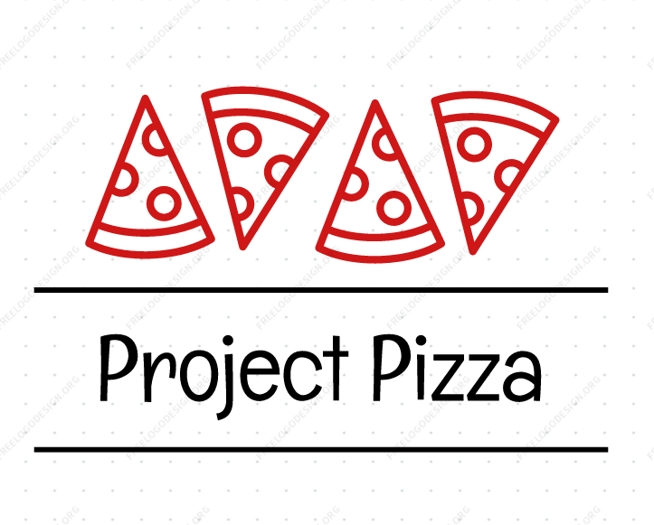

 </a>

<h3 align="center">Project Pizza</h3>

---

Find that perfect slice! [https://glenluersman.github.io/project-pizza/](https://glenluersman.github.io/project-pizza/)

## 

- [About](#about)
- [Usage](#usage)
- [Built With](#built_using)
- [Authors](#authors)
- [Questions](#questions)
- [Screenshots](#screenshots)

## 

Project Pizza is a website that searches for pizzerias within 25 miles of your address. Upon entering your address and clicking submit you are presented with the 10 top rated pizzerias within 25 miles. Your search address is then saved in the search history. Each card displays an image, name and address of pizzeria, and a button for directions to the pizzeria from your address. Upon clicking the directions button a modal pops up with the directions. 

## 

1. Enter address into search form and click submit.
2. Search addresses are stored under search history for ease of use at a later time.
3. Click directions on any of the cards to display directions from our address to the pizzeria.

## 

- HTML
- Bulma
- Javascript

## 

- [glenluersman](https://github.com/glenluersman)
- See also the list of [contributors](https://github.com/YourFunkyDad/project-pizza/contributors) who participated in this project.

## 

- Feel free to open an issue or contact me directly at glen.luersman@gmail.com if you have any questions about the repo. You can find more of my work at [glenluersman](https://github.com/glenluersman/).

## 

